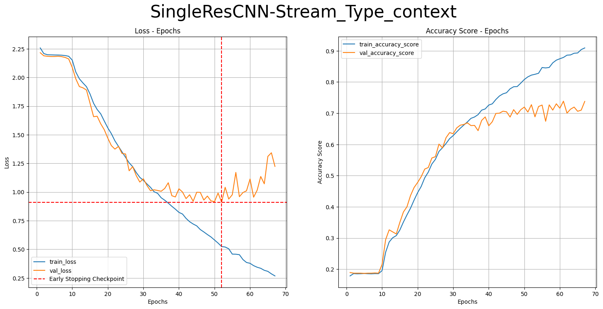
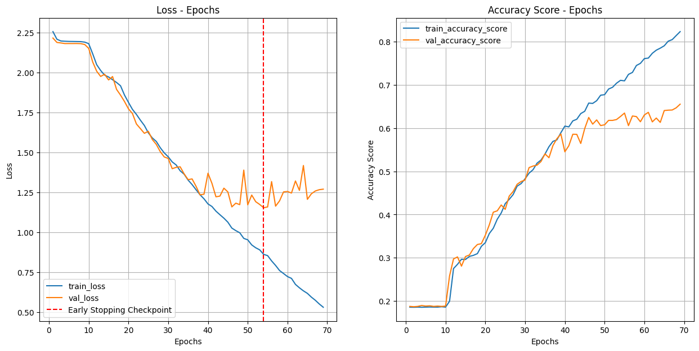
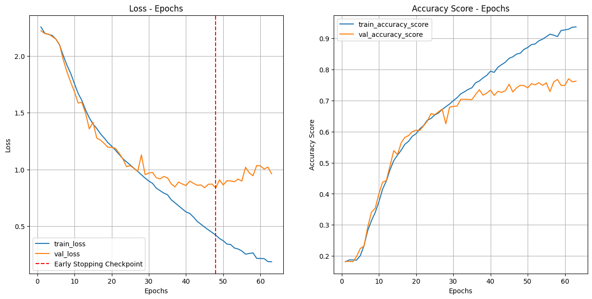

# VideoClassification-CNN
Lite version of the following Oxford project: Large-scale Video Classification with Convolutional Neural Networks

## Choose Sport Labels
|Label ID           |Label Name|
|-------------------|----------|
|398|rugby|
|300|formula racing|
|361|beach volleyball|
|368|basketball|
|415|karate|
|277|motocross|
|111|kitesurfing|
|269|motorcycle racing|
|258|horse racing|
|200|bodybuilding|

# Results
* **Single Frame**
* **Single Frame Context**
* **Single Frame Fovea**
* **Single Frame Multiresolution**
* **Multi Frame Early Fusion**
* **Multi Frame Late Fusion**
* **Multi Frame Slow Fusion**

## Summary
|Model Name                      |Test Loss|Test Accuracy Score|Testing Time in minutes|Training Time in hours|
|--------------------------------|---------|-------------------|-----------------------|----------------------|
|SingleResCNN-Stream_Type_None   |0.96767  |0.71325            |0.37903                |1.53495               |
|SingleResCNN-Stream_Type_fovea  |1.26127  |0.58379            |0.17914                |1.20548               |
|SingleResCNN-Stream_Type_context|1.17831  |0.65533            |0.16217                |1.16977               |
|MultiResCNN                     |1.12028  |0.63378            |0.13316                |1.52294               |
|LateFusionCNN                   |1.05671  |0.69669            |0.37975                |3.01682               |
|EarlyFusionCNN                  |1.08308  |0.67226            |0.67731                |3.79941               |
|SlowFusionCNN                   |1.27412  |0.6623             |1.42234                |7.80681               |
